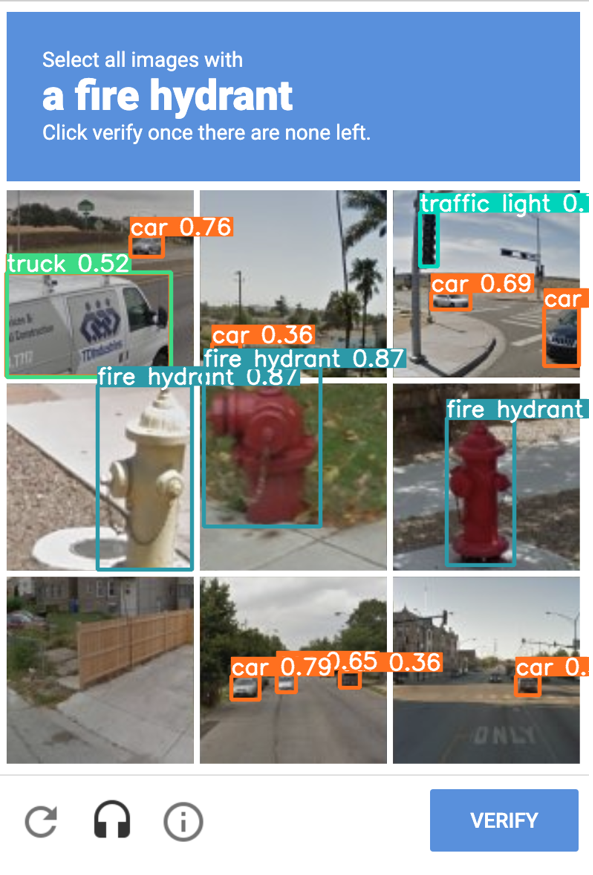
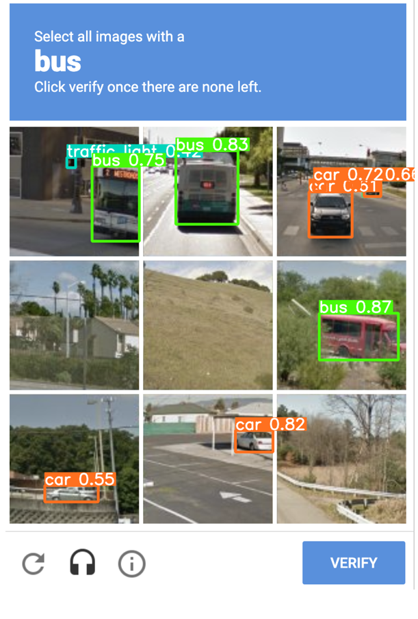

# YOLOv5-ReCaptcha

A proof of concept Recaptcha solver using YOLOv5. This tutorial shows that with a better trained object detection weight file, ReCaptcha can be easily solved.

## Installation

Install requirements and download pretrained weights:

```
$ pip3 install -r ./docs/requirements.txt
```

## Quick start

In this part, we will use pretrained weights to make predictions on ReCaptcha.

```
$ python image_demo.py
```




## TODO:

- Click images using their pixel positions after finding objects and click VERIFY.
- Using NLP to find relation between "find buses" -> "bus" etc.
- Solve multiple screens such as "skip" or "until no objects left".

## Credits:
[Ozankaraali](https://github.com/ozankaraali/yolov3-recaptcha)
